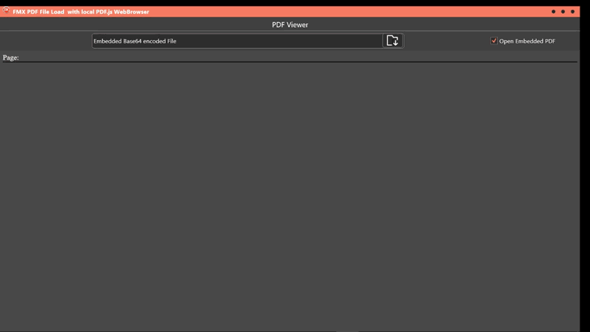
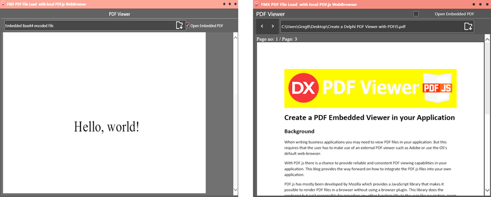

Create

**Create a PDF Embedded Viewer in your Application**

**Background**

When writing business applications you may need to view PDF files in your
application. But this requires that the user has to make use of an external PDF
viewer such as Adobe or use the OS’s default web-browser.

With PDF.js there is a chance to provide reliable and consistent PDF viewing
capabilities in your application. This blog provides the way forward on how to
integrate the PDF.js files into your own application.

PDF.js has mostly been developed by Mozilla which provides a JavaScript library
that makes it possible to render PDF files in a browser without using a browser
plugin. This library does the rendering but isn’t responsible for providing any
other functionality to the user like navigation, zoom levels or printing.

Additionally, there’s a complete viewer (implemented using html, CSS and
JavaScript) that does the things mentioned above with all the features
controlled within the browser.

As PDF.js uses many technologies provided by modern browsers only and does not
work with old browsers like Internet Explorer 8.

PDF.js is licensed under the “Apache License, Version 2.0” that makes it
possible to use it in your own application.

There two ways in which one might want to view a PDF-continuous page method or
PDF- Page by page method.

So how do you take advantage of the browser in offline state to open PDF files
directly within your application? Read on to find out how to integrate both
methods is described.

**Tools**

-   IDE - Delphi 10.2.3 IDE using the INDY third Party components.

-   PDF.js JavaScript library.

-   Created in FMX - the code is portable to VCL.

**The Application**

**Objectives**

Create a Proof of Concept Delphi styled Application that loads a PDF as though
it were fully controlled by the Delphi components. The application must be able
to load an embedded PDF and open an external PDF.

Two versions are created:-

-   PDF is vertically scrolled with no page breaks from first page to the last
    page.

-   PDF shows singular page, opened at first page then button controlled to
    increase or decrease pages.

This is a standard FMX application using the standard toolset. Indy Encoding
components are used which is part of the supplied IDE.

**Creation steps**

The skeleton of the application will not be explained but the technical core
will be highlighted.

**Scrollable PDF -How it is set up?**

An html file is created with the PDF.js functions to load the PDF to a canvas
area in the web browser. The html file will call the external PDF.js library and
necessary css files. These files will reside with the other files to be compiled
in the Application. All these files are used to ensure that the PDF to view will
be opened in the embedded web browser component.

The checkbox when filled will allow an embedded pdf be opened directly else the
open button with the checkbox unchecked will allow the user to select a pdf file
on your local OS.

**Scrollable PDF Functionality**

The pdf loads up and the user can scroll the PDF.

**Single Page Button controlled PDF Functionality**

The PDF loads up the first page and the user can click on the next button or
return button to load a new page. Only one page is viewed at any time.

If you are familiar with JavaScript and Delphi then the following steps will be
easy to follow.

**Creating the html file**

PDF.js library comprises of **text_layer_builder.css** and
**text_layer_builder.js.** These files are called by the html form.

Create a div-id ‘container’ for the pdf to be directly loaded. Create a
canvas-id ‘the-canvas’

for the embedded pdf.

The ‘function externalPDF(Convertedfile,num)’ will load the binary PDF that is
in the variable ‘ConvertedFile’ and the page number in the variable num. The
function uses the

‘text_layer_builder.js’ to extract each page-number and then processes the
‘ConvertedFile’.

The container Id is used as the position where the pdf must be rendered on the
web-browser’s canvas. It loops through each pages and adds each page onto the
previous page with ‘container.appendChild(div)’.

**Continuous PDF Pages Code -PDFjsindex.htm**

\<html\>

\<head\>

\<style\>

html{

background-color:\#454545;

color:\#ffffff;

}

\</style\>

\<meta charset="UTF-8"\>

\<title\>Bayseanblog\</title\>

\<script src="pdf.js"\>\</script\>

\<link type="text/css" href="text_layer_builder.css" rel="stylesheet"\>

\<script type="text/javascript" src="text_layer_builder.js"\>\</script\>

\</head\>

\<body\>

\<div\>

\<span\> Page: \</span\>\\</span\>

\</div\>

\
\</div\>

\<canvas id="the-canvas" \>\</canvas\>

\<script\>

function externalPDF(Convertedfile,num){

var pdfbinary = Convertedfile;

var pdfData = atob(pdfbinary);

PDFJS.workerSrc = "pdf.worker.js";

PDFJS.getDocument({data: pdfData}).then(function getPdfDelphiBin(pdf) {

document.getElementById("page_count").textContent = pdf.numPages;

// Get div\#container and cache it for later use

var container = document.getElementById("container");

// Loop from 1 to total_number_of_pages in PDF document

for (var i = 1; i \<= pdf.numPages; i++) {

// Get desired page

pdf.getPage(i).then(function getPageDelphiBin(page) {

var scale = 1.5;

var viewport = page.getViewport(scale);

var div = document.createElement("div");

// Set id attribute with page-\#{pdf_page_number} format

div.setAttribute("id", "page-" + (page.pageIndex + 1));

// This will keep positions of child elements as per our needs

div.setAttribute("style", "position: relative");

// Append div within div\#container

container.appendChild(div);

// Create a new Canvas element

var canvas = document.createElement("canvas");

// Append Canvas within div\#page-\#{pdf_page_number}

div.appendChild(canvas);

var context = canvas.getContext('2d');

canvas.height = viewport.height;

canvas.width = viewport.width;

var renderContext = {

canvasContext: context,

viewport: viewport

};

// Render PDF page

page.render(renderContext)

});

>   }

>   });

>   };

>   \</script\>

>   \</body\>

>   \</html\>

**PDF Button Control Pages Code -PDFjsindex.htm**

The same JavaScript PDF.JS library files are used. Create a canvas-id
‘the-Canvas’ for the pdf to be directly loaded and / or for the embedded pdf to
be loaded to. Functions for the changed pages are included.

This ‘function NextPage(Convertedfile)’ will be called from the next Delphi
button and the

‘function PriorPage(Convertedfile)’ will be called from the prior Delphi button.

The ‘function externalPDF(Convertedfile,num)’ will load the binary PDF that is
in the variable ‘ConvertedFile’ and the page number in the variable num. The
function

‘text_layer_builder.js’ extracts the page-number and then processes the
‘ConvertedFile’.

Finally the page is rendered to the Canvas of the browser.

\<html\>

\<head\>

\<style\>

html{

background-color:\#454545;

color:\#ffffff;

}

\</style\>

\<meta charset="UTF-8"\>

\<title\>Bayseanblog\</title\>

\<script src="pdf.js"\>\</script\>

\<link type="text/css" href="text_layer_builder.css" rel="stylesheet"\>

\<script type="text/javascript" src="text_layer_builder.js"\>\</script\>

\</head\>

\<body\>

\<div\>

\<span\> Page no: \</span\>\\</span\>\<span\> / \</span\>

\<span\> Page: \</span\>\\</span\>

\</div\>

\<canvas id="the-canvas" style="border:1px solid black"\>\</canvas\>

\<script\>

var num = 1;

var totalpages ;

var pageNum ;

function NextPage(Convertedfile){

pageNum = document.getElementById("page_num").textContent;

totalpages = document.getElementById("page_count").textContent;

pageNum++;

if (pageNum \> totalpages){

return}else{

externalPDF(Convertedfile,pageNum);

}

}

function PriorPage(Convertedfile){

if (document.getElementById("page_num").textContent \<= 1) {

return;

}

pageNum = document.getElementById("page_num").textContent;

pageNum--;

externalPDF(Convertedfile,pageNum);

}

function externalPDF(Convertedfile,num){

var pdfbinary = Convertedfile;

var pdfData = atob(pdfbinary);

PDFJS.workerSrc = "pdf.worker.js";

PDFJS.getDocument({data: pdfData}).then(function getPdfDelphiBin(pdf) {

pdf.getPage(num).then(function getPageDelphiBin(page) {

document.getElementById("page_num").textContent = num;

document.getElementById("page_count").textContent = pdf.numPages;

var scale = 1.5;

var viewport = page.getViewport(scale);

// Prepare canvas using PDF page dimensions.

var canvas = document.getElementById("the-canvas");

var context = canvas.getContext("2d");

canvas.height = viewport.height;

canvas.width = viewport.width;

// Render PDF page into canvas context.

var renderContext = {

canvasContext: context,

viewport: viewport

};

page.render(renderContext);

});

});

};

\</script\>

\</body\>

\</html\>

**The Delphi Code**

On clicking on the open pdf button with the checkbox ticked loads the embedded
PDF file to load else if unchecked will open the open-dialog for a PDF to be
loaded. The first step is to open this file into a ‘stringstream’. This is the
fastest method without using third party options. This data is loaded into a
string variable ‘sendfileinfo’ using the ‘stringstream.datastring’ method. We
write a simple try and repeat process until this string variable is fully loaded
or else the process falls over. (This seems to be the best option as all other
options including threading will fall over. ) Base64 is called to convert the
string into a binary string for the JavaScript to read.

procedure TfmPDFview.SpeedButton1Click(Sender: TObject);

var

flength,flength1:integer;

value: Integer;

i:integer;

StStream: TStringStream;

ConvertedFile:string;

MIMEEncoder:TidEncoderMime;

begin

webbrowser1.Reload; //reload to free Ram

if not checkbox1.ischecked then

begin

if opendialog1.Execute then // will not like large files

try

edit1.Text:= opendialog1.FileName;

//StringStream works faster than Filestream or Bufferedfilestream

//TStringStream will not open files with a size close to a gigabyte and greater

// A third party library replacement will be required to perform this

StStream := TStringStream.Create('');

StStream.LoadFromFile(opendialog1.filename);

sendfileinfo:= StStream.DataString;

flength:= 0;

flength1:=0;

if Length(StStream.Datastring) \<\> 0 then

repeat

flength1:= flength;

flength:= Length(StStream.datastring);

until

flength = flength1;

finally

if length(sendfileinfo) = Length(Ststream.DataString) then

StStream.free;

end;

Base64encode(Self);

if timer1.Enabled then

timer1.Enabled:= false;

setTimer(false);

LoadBrowser(Self);

end

else

begin

edit1.Text:= 'Embedded Base64 encoded File ';

DataJs:= '';

DataJS:= Embeddedfile ;

Timer2.Enabled:= true;

end;

end;

The ‘SendFileInfo’ string is base64encoded using Indy ‘TIDEncoderMime’ using the
OSDefault textEncoding. The new string ‘ConvertedFile’ is ready to be sent to
the web-browser.

procedure TfmPDFview.Base64encode(Sender: Tobject);

var

MIMEEncoder:TidEncoderMime;

begin

try

MimeEncoder:= TIdEncoderMime.Create(nil);

Convertedfile:=
MimeEncoder.encodestring(Sendfileinfo,IDGlobal.IndyTextEncoding_OSDefault);

finally

MimeEncoder.free;

end;

end;

A new JavaScript styled string is created that will call the ‘function
externalPDF()’ that resides in the html-file. The call to ‘evaluateJavascript’
then processes the JavaScript in the web-browser.

The JavaScript then processes the binary code to render a PDF.

procedure TfmPDFview.LoadBrowser(Sender: TObject);

var

js:string;

begin

js:= 'externalPDF("' +Convertedfile+ '",1);';

webbrowser1.EvaluateJavaScript(js);

end;

Processing the Embedded file requires a different process. The file in this
example is coded as string in the Delphi pas unit. It has the already converted
to binary code and the full JavaScript function to load in the html file.

function TfmPDFview.Embeddedfile:string;

var

js:string;

begin

js:=

'var pdfData = atob("'+

'JVBERi0xLjcKCjEgMCBvYmogICUgZW50cnkgcG9pbnQKPDwKICAvVHlwZSAvQ2F0YWxvZwog' +

'IC9QYWdlcyAyIDAgUgo+PgplbmRvYmoKCjIgMCBvYmoKPDwKICAvVHlwZSAvUGFnZXMKICAv' +

'TWVkaWFCb3ggWyAwIDAgMjAwIDIwMCBdCiAgL0NvdW50IDEKICAvS2lkcyBbIDMgMCBSIF0K' +

'Pj4KZW5kb2JqCgozIDAgb2JqCjw8CiAgL1R5cGUgL1BhZ2UKICAvUGFyZW50IDIgMCBSCiAg' +

'L1Jlc291cmNlcyA8PAogICAgL0ZvbnQgPDwKICAgICAgL0YxIDQgMCBSIAogICAgPj4KICA+' +

'PgogIC9Db250ZW50cyA1IDAgUgo+PgplbmRvYmoKCjQgMCBvYmoKPDwKICAvVHlwZSAvRm9u' +

'dAogIC9TdWJ0eXBlIC9UeXBlMQogIC9CYXNlRm9udCAvVGltZXMtUm9tYW4KPj4KZW5kb2Jq' +

'Cgo1IDAgb2JqICAlIHBhZ2UgY29udGVudAo8PAogIC9MZW5ndGggNDQKPj4Kc3RyZWFtCkJU' +

'CjcwIDUwIFRECi9GMSAxMiBUZgooSGVsbG8sIHdvcmxkISkgVGoKRVQKZW5kc3RyZWFtCmVu' +

'ZG9iagoKeHJlZgowIDYKMDAwMDAwMDAwMCA2NTUzNSBmIAowMDAwMDAwMDEwIDAwMDAwIG4g' +

'CjAwMDAwMDAwNzkgMDAwMDAgbiAKMDAwMDAwMDE3MyAwMDAwMCBuIAowMDAwMDAwMzAxIDAw' +

'MDAwIG4gCjAwMDAwMDAzODAgMDAwMDAgbiAKdHJhaWxlcgo8PAogIC9TaXplIDYKICAvUm9v' +

'dCAxIDAgUgo+PgpzdGFydHhyZWYKNDkyCiUlRU9G'+

'");'+

// 'alert(pdfData);'+

' PDFJS.workerSrc = "pdf.worker.js"; '+

' PDFJS.getDocument({data: pdfData}).then(function getPageDelphiEmbed(pdf) { '+

// Fetch the first page.

' pdf.getPage(1).then(function getPageDelphiEmbed(page) { '+

// ' document.getElementById("page_num").textContent = 1; ' +

' document.getElementById("page_count").textContent = 1;'+

' var scale = 4.8;' +

' var viewport = page.getViewport(scale); '+

// Prepare canvas using PDF page dimensions.

' var canvas = document.getElementById("the-canvas"); '+

' var context = canvas.getContext("2d");'+

' canvas.height = viewport.height;'+

' canvas.width = viewport.width;'+

// Render PDF page into canvas context.

' var renderContext = { '+

' canvasContext: context,'+

' viewport: viewport'+

' }; '+

' page.render(renderContext); '+

' }); '+

' }); ';

result:= js;

end;

The string data is loaded into the ‘Datajs’ string variable. Once loaded the
timer fires to call the ‘eval function’ which will load the data into the html
file.

procedure TfmPDFview.Timer2Timer(Sender: TObject);

begin

timer2.Enabled:= false;

eval(self,Datajs);

end;

**Other Options**

-   JavaScript Zooming can be added controlled by Delphi buttons.

-   Text Highlighting to copy pages manually or automatically. Will require a
    call-back function.

-   Set up towards JavaScript OCR processing. Will require call-back function.

    **Android and IOS Platforms**

Other platforms have not been tested as this is proof of concept and not
production level code. Different platforms require different encoding when
loading to a ‘stringstream’ and then on to base64encoding.

-   TStringStream.Create('',Tencoding.ansi…);//will require the correct input
    coding

-   Base64encoding text-encoding format.

-   The open-file dialog will not function for Android and another routine will
    be required for this.

-   The embedded option should compile in any platform.

**BayeseanBlog**

For more related blogs. www.bayeseanblog.com

**Download**

Feel free to download the Source code for these two Applications.

Happy Coding
